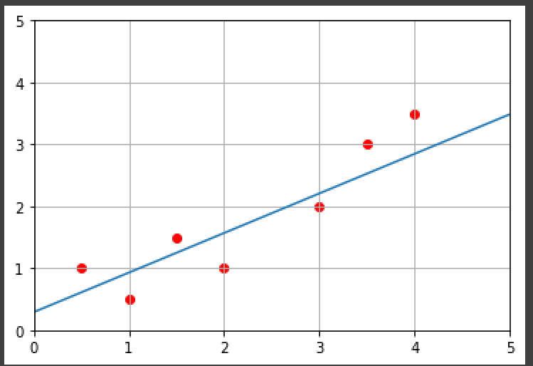
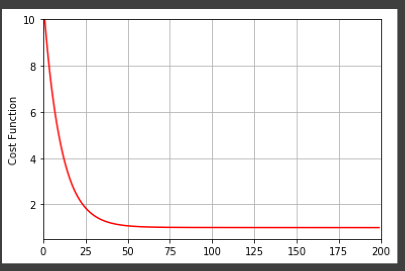

Gradient descent
================

Introduction
------------
A simple Python code to apply the gradient descent (single linear regression) algorithm on some simple data for AI university assignment.

plots
--------

Installation
------------
You will need to have some libraries This includes:
*  pyplot in matplotlib
